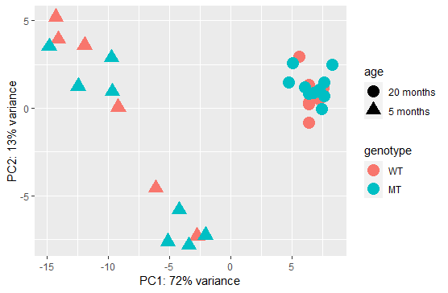
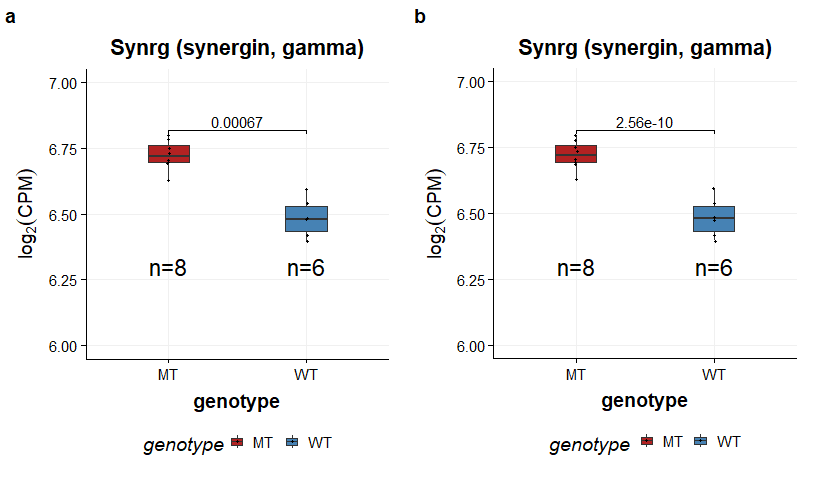
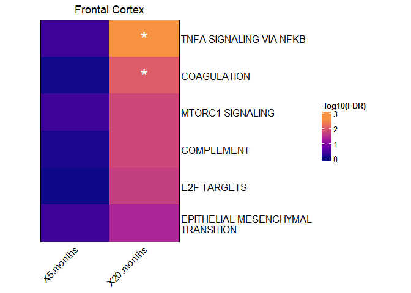
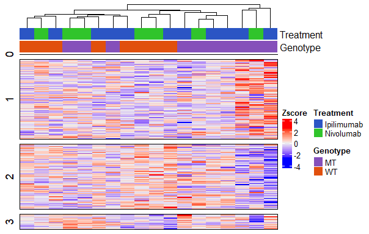
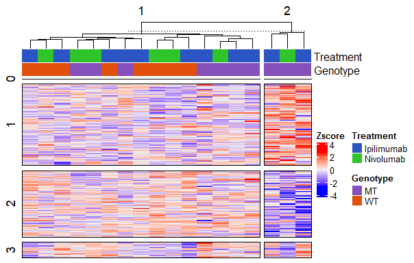

-   [**Introduction**](#introduction)
-   [**Differential gene expression
    analysis**](#differential-gene-expression-analysis)
-   [**Weighted correlation network
    analysis**](#weighted-correlation-network-analysis)
-   [**Session info**](#session-info)

## **Introduction**

This vignette shows a very basic differential gene expression workflow
and downstream analyses. The data that will be used comes from the [Gene
Expression Omnibus
GSE99354](https://www.ncbi.nlm.nih.gov/geo/query/acc.cgi?acc=GSE99354)
and contains bulk RNA sequencing data from mice.

Among other things, the authors examined gene expression differences
between WT mice and mice carrying a TDP-43 Q331K mutation in 5-month or
20-month old frontal cortex tissue, respectively.

``` r
library(DGEvistools)
library(tidyverse)
# load in the example data. For generation of it, check scripts in data-raw directory.
# load raw counts
data(counts)

# load metadata which contains additional information about the sequenced samples, for example different batches, RNA integrity, ...
data(mdata)

# load annotation data, which contains additional information about the genes for which we have expression data
data(annotation)

# each row in the metadata corresponds to exactly one column in the counts data
stopifnot(all(colnames(counts) == rownames(mdata)))

# each row in the annotation table corresponds to one gene (row) in the counts table
stopifnot(all(rownames(counts) == rownames(annotation)))
```

<br >

<br />

## **Differential gene expression analysis**

For the differential gene expression analysis we can use `DESEq2`. For
that we create a `SummarizedExperiment`, which holds additional
information about the experiment, such as gene annotations or
conditions.

``` r
library(DESeq2)

# create a `SummarizedExperiemnt`
se <- SummarizedExperiment(assays = list("counts"=counts),
                           colData=mdata,
                           rowData=annotation) 

# Construct DESeqDataSet. Because we are interested in the difference between genotypes we specify the design accordingly
ddsSE <- DESeqDataSet(se, design = ~ genotype)
ddsSE$genotype <- relevel(ddsSE$genotype, ref="WT")


# perform VST transformation for explorative analysis
vsd <- vst(ddsSE)

# plot PCA
pcaData <- plotPCA(vsd, intgroup=c("genotype", "age"), returnData=TRUE)
percentVar <- round(100 * attr(pcaData, "percentVar"))
ggplot(pcaData, aes(PC1, PC2, color=genotype, shape=age)) +
  geom_point(size=5) +
  xlab(paste0("PC1: ",percentVar[1],"% variance")) +
  ylab(paste0("PC2: ",percentVar[2],"% variance"))
```



In the PCA, we can see that there are large transcriptomic differences
between 5-month and 20-month old frontal cortices. Because the main
focus of the analysis is the transcriptomic difference due to the
genotype, we will analyze the 5-month and 20-month old cortex
separately.

``` r
# as determined above, we perform DGE separately for 5month and 20month old cortex
DGE_result <- list()

for (age in unique(colData(ddsSE)$age)){
  dds_tmp <- ddsSE[,ddsSE$age == age]
  dds_tmp <- DESeq(dds_tmp)
  res <- results(dds_tmp)
  res <- res[order(res$pvalue),]
  
  # add the gene symbol and description
  res <- res %>%
    as.data.frame() %>%
    rownames_to_column("ensembl_id") %>%
    left_join(., data.frame(rowData(ddsSE)), by="ensembl_id")
  
  DGE_result[[age]]<- res
}
```

<br >

<br />

### **Visualize results**

The most common way to visualize results of a differential gene
expression experiment is the volcano plot. We can generate one very
easily using this function. It also allows you to highlight genes that
you are interested in.

``` r
p1<-volcano_plot(de_res = DGE_result$`5 months`, title = "5-month old frontal cortex", 
             subtitle = "6 WT TDP43, 8 MT TDP43",  logFC_threshold = 0.25,
             annotate_by = c("Col4a2", "Fgf12", "Meaf6"), xlim = c(-2,2))

p2<-volcano_plot(de_res = DGE_result$`20 months`, title = "20-month old frontal cortex", 
             subtitle = "8 WT TDP43, 10 MT TDP43",  logFC_threshold = 0.25,
             annotate_by = c("Synrg", "Spop", "Kras"), xlim = c(-2,2))

cowplot::plot_grid(p1, p2, labels = "auto")
```


<br >

<br />

We can also check how similar the differential gene expression results
are for the genes of differently aged frontal cortices.

``` r
p1<-plot_de_correlation(result_df1 = DGE_result$`5 months`,
                    result_df2 = DGE_result$`20 months`,
                    title_result_1 = "5-month old frontal cortex",
                    title_result_2 = "20-month old frontal cortex",
                    col="stat") 
```

    #> 189 entries were removed, because we are only plotting values between the 1st and 99th percentile. Specify `remove_outlier=F` to disable.

``` r
p2<-plot_de_correlation(result_df1 = DGE_result$`5 months`,
                    result_df2 = DGE_result$`20 months`,
                    title_result_1 = "Base expression\n5-month FC",
                    title_result_2 = "Base expression\n20-month FC",
                    col="baseMean") 
```

    #> 125 entries were removed, because we are only plotting values between the 1st and 99th percentile. Specify `remove_outlier=F` to disable.

``` r
cowplot::plot_grid(p1, p2, labels = "auto")
```


<br >

<br />

Often it is useful to compare the expression of genes using boxplots.

``` r
# For this, we first transform our raw counts to log2(CPM).
assays(se)$cpm_counts <- edgeR::cpm(se, log=T)

# We are only showing the results for the 5 month old frontal cortex
se_5month <-se[,se$age == "5 months"]

# Simple boxplot using a wilcoxon test to asses significance. THIS IS ONLY FOR VISUALIZATION PURPOSES! THIS P VALUE SHOULD NEVER BE USED
p1<-create_expression_boxplot(gene = "Synrg", SE = se_5month, 
                          intgroup = "genotype",
                          test_comparison = list(c("MT","WT")), # optional
                          ymin=6, # optional
                          ymax=7, # optional
                          colors = c("firebrick","steelblue")) #optional 


# If we have the DESeq2 results, we can also use the p value determined with DESeq2
p2<-create_expression_boxplot(gene = "Synrg", SE = se_5month, 
                          intgroup = "genotype",
                          test_comparison = list(c("MT","WT")), # optional
                          ymin=6, # optional
                          ymax=7, # optional
                          colors = c("firebrick","steelblue"), # optional
                          DESEq_res = DGE_result$`5 months`) #optional 
cowplot::plot_grid(p1, p2, labels = "auto")
```



``` r
# It is also very easy to visualize a varity of different genes and save them all in a pdf document:
plots <- list()
gene_list <- c("Gid4", "Spop", "KRAS","Synrg") # any genes you want to visualize. Automatically skips genes that are not found.
for(gene in gene_list){
  print(gene)
  p<-create_expression_boxplot(gene = gene, SE = se_5month, 
                          intgroup = "genotype",
                          test_comparison = list(c("MT","WT")), # optional
                          colors = c("firebrick","steelblue"), # optional
                          DESEq_res = DGE_result$`5 months`) #optional 


  plots[[gene]] <- p
}
```

    #> [1] "Gid4"
    #> [1] "Spop"
    #> [1] "KRAS"
    #> [1] "Gene symbol was not found in SummarizedExperiment, returning empty plot"
    #> [1] "Synrg"

``` r
# save them all as one big pdf to disk.
pdf_plot <- cowplot::plot_grid(plotlist = plots, ncol=2)

# here we save it as a random temp file.
out_file = tempfile(fileext = ".pdf")
cowplot::save_plot(out_file, pdf_plot,  base_height = 4.7, ncol = 2,
          nrow=ceiling(length(plots)/2),
          limitsize = FALSE)
```

### Gene set enrichment analysis

A common downstream analysis step of DGE analysis is gene set enrichment
analysis (GSEA). We are using gene sets from the MSigDB database, but
one could just as well use different gene ontologies.

``` r
# load the hall mark gene set for mouse
h_gene_sets <- msigdbr::msigdbr(species = "mouse", category = "H") %>% 
  dplyr::select(gs_name, ensembl_gene)

# order our genes by logFC. In practice, it makes sense to run logFC shrinkage first from the DESeq2 package. We skip this here because it takes a while and downstream analysis is exactly the same.
ranked_gene_list <- lapply(setNames(names(DGE_result),names(DGE_result)), function(age){
  DGE_result[[age]] %>% 
    dplyr::arrange(desc(log2FoldChange)) %>% 
    dplyr::select(ensembl_id,log2FoldChange) %>% 
    tibble::deframe()}
  )

# run GSEA and combine results in one dataframe
GSEA_result <-lapply(setNames(names(DGE_result),names(DGE_result)), function(age){
  tmp <- pkgcond::suppress_messages(clusterProfiler::GSEA(ranked_gene_list[[age]], 
                                                          TERM2GENE=h_gene_sets, 
                                                          pvalueCutoff = 1))@result %>%
    dplyr::mutate(age=age)
}) %>% dplyr::bind_rows()


enrichment_heatmap(gsea_df = GSEA_result, 
                  top_n = 6,
                  ordering = "20 months",
                  comparisons_column = "age", 
                  title = "Frontal Cortex",
                  color = viridis::plasma(50,end=0.75),
                  remove_string = "HALLMARK_") # remove uninformative string
```



## **Weighted correlation network analysis**

Another potentially downstream analysis is Weighted correlation network
analysis (WGCNA). For this we will use the GWENA pacakge which provides
a nice wrapper function.

**Note**: When performing WGCNA you ideally have many samples, **at
least 15 samples**.

``` r
library(GWENA)
# you might want to select for example only the 70% most variable genes before running GWENA. 
# We skip this here, because we only have 5k genes to begin with

# build net. On a real world data set this might take a long time.
vst_counts_20_month <- assay(vsd[,vsd$age == "20 months"])
net <- build_net(t(vst_counts_20_month), cor_func = "pearson", network_type="signed", n_threads=1)

# detect modules. You might want to try out different thresholds.
# you can also perform an overrepresentation analysis with the genes of the different modules, to get insights 
# into the biological function of the modules.
modules <- detect_modules(t(vst_counts_20_month),
                          net$network,
                          detailled_result = TRUE,
                          merge_threshold = 0.2)

# save the detected modules to disk, so we do not have to rerun everything each time.
# we save it as a temp file, but you should save it somewhere accessible.
module_save_path <- tempfile()
saveRDS(modules, module_save_path)


# Visualize the GWENA result in a heatmap
# for that scale counts.
scaled_counts <- vst_counts_20_month %>% t() %>% scale() %>% t()


# we also have to create the annotation dataframe for the columns.
suppressPackageStartupMessages(library(ComplexHeatmap))
ht_opt$message = FALSE
# the annotation that we add here are pretty meaningless, but the might be something like batch, or treatment status.
set.seed(123)
mdata$treatment <- sample(c("Ipilimumab","Nivolumab"),replace = T, size = nrow(mdata))

# filter to only contain FC 20 month old
mdata_20 <- mdata %>% 
  dplyr::filter(age=="20 months")


ha <- HeatmapAnnotation("Treatment" = mdata_20$treatment,
                        "Genotype" = mdata_20$genotype,
                        col = list(Treatment= setNames(c("#30C42B", "#2B55C4"), unique(mdata_20$treatment)),
                                   Genotype = setNames(c("#E1500D","#8550BA"),unique(mdata_20$genotype))))
  
# Here we do not see any striking patterns, but this is because our dataset is small compared to a real one.
gwena_heatmap(scaled_counts = scaled_counts,
              mdata = mdata_20 %>% rownames_to_column("ID"), 
              info_col = "ID",
              GWENA_modules = module_save_path,
              heatmap_annotation = ha)
```



``` r
# It is also possible to split columns based on the results of a clustering algorithm:
# This can be any algorithm. The result should be a named vector where each sample is assigned to one cluster.
# Here, as a showcase, we use standard `hclust` 

dists <- dist(t(scaled_counts))
hc <- hclust(dists)
# we specify that the tree should be cut so that 3 clusters emerge.
clustering_result <- cutree(hc, k=2)

gwena_heatmap(scaled_counts = scaled_counts,
              mdata = mdata_20 %>% rownames_to_column("ID"), 
              info_col = "ID",
              GWENA_modules = module_save_path,
              heatmap_annotation = ha,
              column_cluster = clustering_result)
```



### **Associate modules with phenotype**

To associate identified expression modules with phenotypes, it is useful
to look at the *eigengene expression* of a sample. The *eigengene
expression* is calculated for each patient and module and basically
summarizes the expression of a module for a given patient. Using the
*eigengene expression* we can look for associations between modules and
clinical variables.

``` r
library(ggpubr)
modules <- readRDS(module_save_path)

# add a random contionus clinical variable
mdata$survival_time <- runif(nrow(mdata), min = 2, 5)


# add the eigengene expression to the metadata
mdata_eigengene <- modules$modules_eigengenes %>% 
  rownames_to_column("ID") %>%
  left_join(., mdata %>% rownames_to_column("ID"), by="ID")

# check for association of categorical variable
# Seems like WT TDP43 carriers have significantly higher module 2 eigengene expression than MT
p1<-module_association(mdata_eigengene = mdata_eigengene,
                   phenotype = "genotype",
                   module_eigengene = "ME2",
                   xlab = "Genotype",
                   ylab= "Module 2\neigengene epxression",
                   colors=c("firebrick","steelblue"))

# check for association of continous variable
p2<-module_association(mdata_eigengene = mdata_eigengene,
                   phenotype = "survival_time",
                   module_eigengene = "ME2",
                   ymin=-0.5, ymax=0.4,
                   xlab = "Survival time [years]",
                   ylab= "Module 2\neigengene epxression",
                   colors=c("firebrick","steelblue"),
                   label_x_pos = 2,
                   label_size = 5)
```

    #> [1] "Assuming phenotype is continuous"
    #> [1] "0 entries contain NA. Removing them"

``` r
pkgcond::suppress_messages(cowplot::plot_grid(p1,p2, labels="auto"))
```


<br >

<br />

## **Session info**

``` r
sessionInfo()
```

    #> R version 4.2.1 (2022-06-23 ucrt)
    #> Platform: x86_64-w64-mingw32/x64 (64-bit)
    #> Running under: Windows 10 x64 (build 19042)
    #> 
    #> Matrix products: default
    #> 
    #> locale:
    #> [1] LC_COLLATE=English_Germany.utf8 
    #> [2] LC_CTYPE=English_Germany.utf8   
    #> [3] LC_MONETARY=English_Germany.utf8
    #> [4] LC_NUMERIC=C                    
    #> [5] LC_TIME=English_Germany.utf8    
    #> 
    #> attached base packages:
    #> [1] grid      stats4    stats     graphics  grDevices utils    
    #> [7] datasets  methods   base     
    #> 
    #> other attached packages:
    #>  [1] ggpubr_0.4.0                ComplexHeatmap_2.12.0      
    #>  [3] GWENA_1.6.0                 ggthemes_4.2.4             
    #>  [5] DESeq2_1.36.0               SummarizedExperiment_1.26.1
    #>  [7] Biobase_2.56.0              MatrixGenerics_1.8.1       
    #>  [9] matrixStats_0.62.0          GenomicRanges_1.48.0       
    #> [11] GenomeInfoDb_1.32.2         IRanges_2.30.0             
    #> [13] S4Vectors_0.34.0            BiocGenerics_0.42.0        
    #> [15] forcats_0.5.1               stringr_1.4.0              
    #> [17] dplyr_1.0.9                 purrr_0.3.4                
    #> [19] readr_2.1.2                 tidyr_1.2.0                
    #> [21] tibble_3.1.7                ggplot2_3.3.6              
    #> [23] tidyverse_1.3.1             DGEvistools_0.1.0          
    #> 
    #> loaded via a namespace (and not attached):
    #>   [1] ragg_1.2.2             bit64_4.0.5           
    #>   [3] knitr_1.39             DelayedArray_0.22.0   
    #>   [5] data.table_1.14.2      rpart_4.1.16          
    #>   [7] KEGGREST_1.36.2        RCurl_1.98-1.7        
    #>   [9] doParallel_1.0.17      generics_0.1.3        
    #>  [11] preprocessCore_1.58.0  snow_0.4-4            
    #>  [13] callr_3.7.0            RhpcBLASctl_0.21-247.1
    #>  [15] cowplot_1.1.1          usethis_2.1.6         
    #>  [17] RSQLite_2.2.14         shadowtext_0.1.2      
    #>  [19] rlist_0.4.6.2          bit_4.0.4             
    #>  [21] tzdb_0.3.0             enrichplot_1.16.1     
    #>  [23] xml2_1.3.3             lubridate_1.8.0       
    #>  [25] assertthat_0.2.1       viridis_0.6.2         
    #>  [27] xfun_0.31              hms_1.1.1             
    #>  [29] jquerylib_0.1.4        babelgene_22.3        
    #>  [31] evaluate_0.15          fansi_1.0.3           
    #>  [33] dbplyr_2.2.1           readxl_1.4.0          
    #>  [35] igraph_1.3.2           DBI_1.1.3             
    #>  [37] geneplotter_1.74.0     htmlwidgets_1.5.4     
    #>  [39] ellipsis_0.3.2         backports_1.4.1       
    #>  [41] gprofiler2_0.2.1       annotate_1.74.0       
    #>  [43] deldir_1.0-6           vctrs_0.4.1           
    #>  [45] remotes_2.4.2          Cairo_1.6-0           
    #>  [47] abind_1.4-5            cachem_1.0.6          
    #>  [49] withr_2.5.0            ggforce_0.3.3         
    #>  [51] checkmate_2.1.0        treeio_1.20.0         
    #>  [53] prettyunits_1.1.1      cluster_2.1.3         
    #>  [55] DOSE_3.22.0            ape_5.6-2             
    #>  [57] lazyeval_0.2.2         crayon_1.5.1          
    #>  [59] genefilter_1.78.0      edgeR_3.38.1          
    #>  [61] pkgconfig_2.0.3        labeling_0.4.2        
    #>  [63] tweenr_1.0.2           pkgload_1.3.0         
    #>  [65] nlme_3.1-158           vipor_0.4.5           
    #>  [67] devtools_2.4.3         nnet_7.3-17           
    #>  [69] rlang_1.0.3            lifecycle_1.0.1       
    #>  [71] downloader_0.4         modelr_0.1.8          
    #>  [73] ggrastr_1.0.1          cellranger_1.1.0      
    #>  [75] polyclip_1.10-0        Matrix_1.4-1          
    #>  [77] aplot_0.1.6            NetRep_1.2.4          
    #>  [79] carData_3.0-5          reprex_2.0.1          
    #>  [81] base64enc_0.1-3        beeswarm_0.4.0        
    #>  [83] processx_3.6.1         GlobalOptions_0.1.2   
    #>  [85] png_0.1-7              viridisLite_0.4.0     
    #>  [87] rjson_0.2.21           bitops_1.0-7          
    #>  [89] Biostrings_2.64.0      blob_1.2.3            
    #>  [91] shape_1.4.6            qvalue_2.28.0         
    #>  [93] jpeg_0.1-9             rstatix_0.7.0         
    #>  [95] gridGraphics_0.5-1     ggsignif_0.6.3        
    #>  [97] scales_1.2.0           memoise_2.0.1         
    #>  [99] magrittr_2.0.3         plyr_1.8.7            
    #> [101] zlibbioc_1.42.0        compiler_4.2.1        
    #> [103] scatterpie_0.1.7       RColorBrewer_1.1-3    
    #> [105] clue_0.3-61            cli_3.3.0             
    #> [107] XVector_0.36.0         ps_1.7.1              
    #> [109] patchwork_1.1.1        htmlTable_2.4.0       
    #> [111] Formula_1.2-4          mgcv_1.8-40           
    #> [113] MASS_7.3-57            WGCNA_1.71            
    #> [115] tidyselect_1.1.2       stringi_1.7.6         
    #> [117] textshaping_0.3.6      pkgcond_0.1.1         
    #> [119] highr_0.9              yaml_2.3.5            
    #> [121] GOSemSim_2.22.0        locfit_1.5-9.5        
    #> [123] latticeExtra_0.6-30    ggrepel_0.9.1         
    #> [125] sass_0.4.1             fastmatch_1.1-3       
    #> [127] tools_4.2.1            parallel_4.2.1        
    #> [129] circlize_0.4.15        rstudioapi_0.13       
    #> [131] foreach_1.5.2          foreign_0.8-82        
    #> [133] gridExtra_2.3          farver_2.1.1          
    #> [135] ggraph_2.0.5           digest_0.6.29         
    #> [137] Rcpp_1.0.8.3           car_3.1-0             
    #> [139] broom_1.0.0            httr_1.4.3            
    #> [141] AnnotationDbi_1.58.0   colorspace_2.0-3      
    #> [143] rvest_1.0.2            XML_3.99-0.10         
    #> [145] fs_1.5.2               splines_4.2.1         
    #> [147] yulab.utils_0.0.5      statmod_1.4.36        
    #> [149] tidytree_0.3.9         graphlayouts_0.8.0    
    #> [151] ggplotify_0.1.0        sessioninfo_1.2.2     
    #> [153] plotly_4.10.0          systemfonts_1.0.4     
    #> [155] xtable_1.8-4           jsonlite_1.8.0        
    #> [157] ggtree_3.4.0           dynamicTreeCut_1.63-1 
    #> [159] tidygraph_1.2.1        ggfun_0.0.6           
    #> [161] R6_2.5.1               Hmisc_4.7-0           
    #> [163] pillar_1.7.0           htmltools_0.5.2       
    #> [165] glue_1.6.2             fastmap_1.1.0         
    #> [167] clusterProfiler_4.4.4  BiocParallel_1.30.3   
    #> [169] codetools_0.2-18       fgsea_1.22.0          
    #> [171] pkgbuild_1.3.1         utf8_1.2.2            
    #> [173] lattice_0.20-45        bslib_0.3.1           
    #> [175] ggbeeswarm_0.6.0       GO.db_3.15.0          
    #> [177] interp_1.1-2           survival_3.3-1        
    #> [179] limma_3.52.2           rmarkdown_2.14        
    #> [181] munsell_0.5.0          DO.db_2.9             
    #> [183] GetoptLong_1.0.5       fastcluster_1.2.3     
    #> [185] GenomeInfoDbData_1.2.8 iterators_1.0.14      
    #> [187] impute_1.70.0          haven_2.5.0           
    #> [189] reshape2_1.4.4         gtable_0.3.0          
    #> [191] msigdbr_7.5.1

[1] European Molecular Biology Laboratory, <nick.hirschmueller@embl.de>
