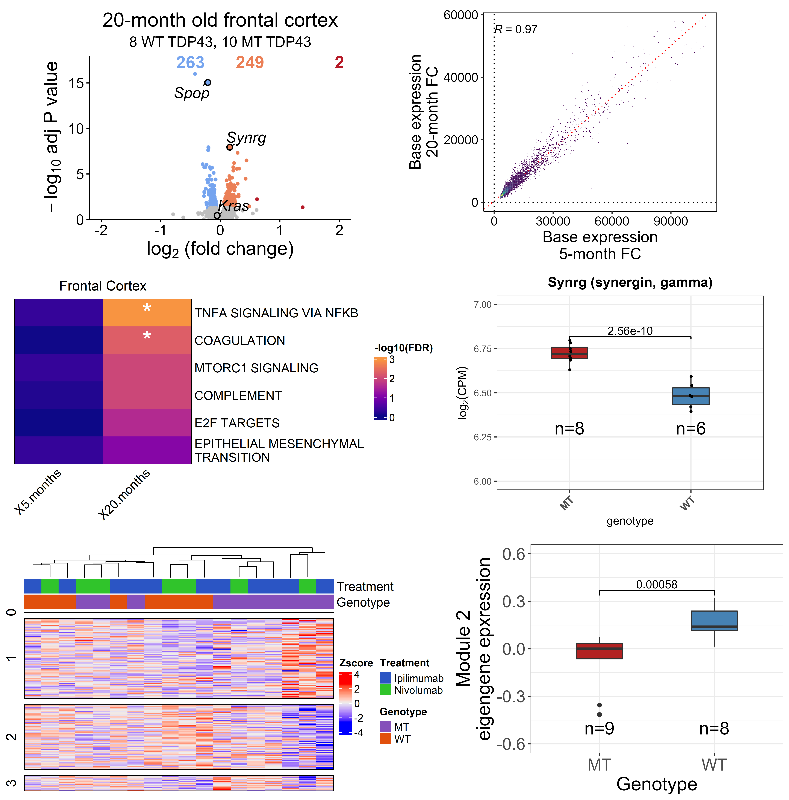

# DGEvistools

This package provides functions, which ease the downstream analysis of differential gene expression analysis (using DESeq2).
For example it allows you to easily plot pretty volcano plots or boxplots, compare GSEA results or visualize the results of weighted gene co-expression network analysis.

For detailed overview of all the functions, check out the [vignette](./doc/Example_RNAseq_workflow.html).
